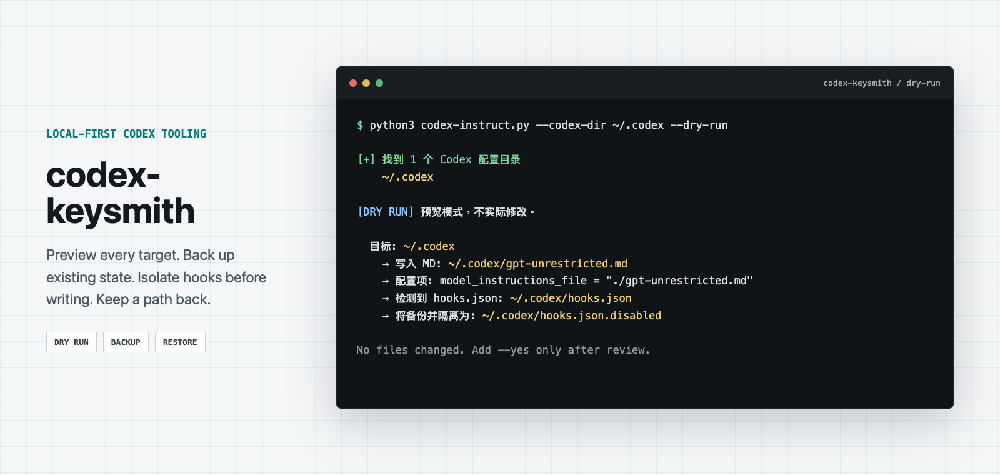

<!-- markdownlint-disable MD013 MD033 MD041 -->
<!-- WINDOWS_FRESH_DEPLOYMENT_POLICY: EXPLICIT_BETA -->

<p align="center">
  
</p>
<p align="center"><em>Illustrative preview / 示意预览；实际路径与输出以本机 dry-run 为准。</em></p>

<h1 align="center">codex-keysmith</h1>

<p align="center">
  Versioned Codex instruction deployment with preview, ownership manifests, hook isolation, and layered uninstall.
</p>

<p align="center">
  <a href="#简体中文">简体中文</a> ·
  <a href="README.en.md">English</a> ·
  <a href="docs/reference.md">Reference</a> ·
  <a href="docs/agent-install.md">智能体安装 / Agent install</a> ·
  <a href="SECURITY.md">Security</a> ·
  <a href="LICENSE">License</a>
</p>

<p align="center">
  <a href="https://github.com/Jia-Ethan/codex-keysmith/actions/workflows/tests.yml"></a>
  
  
  
</p>

## 简体中文

### 这是什么

`codex-keysmith` 是一个零依赖的单文件 Python 脚本，把一份指令 Markdown 部署到你的 Codex 配置目录（`~/.codex`），并让 Codex 的每个新会话都加载它。默认预览、显式确认才写入，支持随时撤销。

**这会改变 Codex 的全局行为，不是项目级设置**：部署会修改 `~/.codex/config.toml` 里的 `model_instructions_file`，因此影响该配置下的**所有新会话**；默认还会暂停你现有的整份 `hooks.json`，直到你显式恢复。本版本不捆绑内置提示词，安装必须通过 `--file` 显式提供 Markdown。工具只负责安全地部署和撤销文件，不认可或验证其中的指令内容。请先完整审阅自己的文件，再部署。

### 全新环境的轻量入口

全新的 workstation 或一次性 sandbox 可以从 script-toolbox 根目录使用
共享 bootstrap：

```bash
./agent/promptctl/promptctl install codex
./agent/promptctl/promptctl install codex --yes
./agent/promptctl/promptctl path codex
```

它只拥有 `config.toml` 中带 marker 的配置块；首次创建的提示词文件随后
归用户所有，重跑不会覆盖，默认卸载也会保留。Agent 可以完整阅读
[`../../AGENT_SETUP.md`](../../AGENT_SETUP.md) 后执行同一个程序。

本页面的独立 `codex-keysmith` 适用于固定来源部署、已有状态迁移、hooks
隔离、中断恢复和分层卸载。不要让两种工具同时管理同一个
`model_instructions_file`。

> [!WARNING]
> 不要在 Windows 上使用已发布的 `v0.1.0`；它有已知的清理缺陷（详见「兼容性与限制」）。v0.1.1 及后续版本已提供原生恢复后端；Windows fresh deployment 仍标记为 beta。

### 从 script-toolbox 使用（macOS / Linux）

```bash
# 从 script-toolbox 仓库根目录运行。
script=agent/promptctl/advanced/codex/codex-instruct.py
prompt=/path/to/personal-rules.md

# 1. 查看版本和现有状态。
python3 "$script" --version
python3 "$script" --codex-dir ~/.codex --status --lang zh-CN

# 2. 显式选择提示词文件并预览。
python3 "$script" --file "$prompt" --codex-dir ~/.codex --dry-run --lang zh-CN

# 3. 确认来源哈希、目标和 hooks 计划无误后才写入。
python3 "$script" --file "$prompt" --codex-dir ~/.codex --yes --lang zh-CN
```

仓库里的 [`examples/your-rules.md`](examples/your-rules.md) 只是中性起点；只有你把它显式传给 `--file` 时才会使用。部署完成后**关闭旧任务、开启一个新的 Codex 会话**：Codex 只在会话启动时加载配置，运行中的会话不会热更新。

省略 `--codex-dir` 会处理全部自动发现的 `.codex` 目录；只有明确需要多目录一起部署时才这样做。

若使用上游独立 Release，不要从浮动 `main` 安装，也不要用
`curl | python`；先从
[Jia-Ethan/codex-keysmith Releases](https://github.com/Jia-Ethan/codex-keysmith/releases)
下载脚本和 `SHA256SUMS`，落盘校验后再运行，并同样显式传入 `--file`。

```bash
python3 codex-instruct-vX.Y.Z.py --codex-dir ~/.codex --status --lang zh-CN
python3 codex-instruct-vX.Y.Z.py --file /path/to/personal-rules.md \
  --codex-dir ~/.codex --dry-run --lang zh-CN
```

### 它会改哪些文件

| 路径 | 会发生什么 |
| --- | --- |
| `<codex-dir>/your-rules.md`（或自定义 `--name`） | 新建，或先备份再替换 |
| `<codex-dir>/config.toml` | 只拥有并修改顶层 `model_instructions_file`；外部工具重写其他字段不会阻塞 status/uninstall，卸载会保留这些字段 |
| `<codex-dir>/hooks.json` | 默认整体隔离为 `hooks.json.disabled`（先备份） |
| `<codex-dir>/.codex-keysmith-manifest.json` | 记录这次部署改了什么，供后续卸载用 |

完整字段、临时事务目录和边界条件见 [`docs/reference.md`](docs/reference.md)。

### 撤销

```bash
# 只想拿回 hooks，不动指令/配置：
python3 agent/promptctl/advanced/codex/codex-instruct.py \
  --codex-dir ~/.codex --restore-hooks --lang zh-CN

# 想整体撤销这次部署（配置、指令、hooks 一起还原）：
python3 agent/promptctl/advanced/codex/codex-instruct.py \
  --codex-dir ~/.codex --uninstall --lang zh-CN        # 先预览
python3 agent/promptctl/advanced/codex/codex-instruct.py \
  --codex-dir ~/.codex --uninstall --yes --lang zh-CN  # 确认卸载
```

卸载每次只撤销最新一层部署；部署过多次的话，重复运行逐层撤销。config 的长期所有权只覆盖顶层 `model_instructions_file`：CCSwitch 等工具重写其他字段时，只要该字段仍引用本层 MD，status 和卸载仍可继续；卸载只恢复/移除部署前的该字段语句并保留其余当前内容。目标字段缺失、改指其他路径、存在歧义或使用扫描器不支持的语句结构仍会 fail closed。

### 出问题了怎么办

| 现象 | 应该做的事 |
| --- | --- |
| 中途被强制中断（比如 `SIGKILL`、断电） | 先 `--status` 看是否报告 `blocked`；有的话用 `--recover` 预览，确认无误再加 `--yes` |
| `--status` 报告异常残留 | 不要手工删除任何 `.codex-keysmith-transaction-*`、备份或 manifest；按上面 `--recover` 流程处理，或参考 [`docs/hooks-transactions.md`](docs/hooks-transactions.md) |
| 想彻底清掉旧备份 | 见 [`docs/reference.md`](docs/reference.md#备份保留与安全清理) 里的清理前置条件，工具本身不自动删备份 |

### 兼容性与限制

- 推荐 Python 3.10–3.14；已验证 Codex CLI `codex-cli 0.144.1`。
- macOS / Linux 是主要支持范围。
- **Windows**：已发布的 `v0.1.0` 存在已知缺陷（`os.utime` 失败后触发第二个 `PermissionError`，会留下无法用旧脚本恢复的 journal）。v0.1.1 及后续版本已重写 Windows 文件系统后端并标记 `EXPLICIT_BETA`，可以试用，但还不是正式支持；如果 v0.1.0 留下了 journal，用最新已校验 Release 脚本按 `--status` → `--recover` 预览 → `--recover --yes` → `--status` 的顺序恢复，不要手工删除任何证据。
- 单文件 CLI，没有 `pip install` 或自动更新；备份和卸载归档不会自动清理。
- 完整限制清单、事务保证、维护者验证步骤见 [`docs/reference.md`](docs/reference.md)。

### 参与贡献与安全报告

提交前阅读 [`CONTRIBUTING.md`](CONTRIBUTING.md)。漏洞通过 [`SECURITY.md`](SECURITY.md) 指定的 GitHub 私密渠道报告；不要在公开 Issue 中粘贴凭证、完整配置或私人路径。

### 友链 / Community

本项目接受 LINUX DO 社区佬友监督与反馈：[LINUX DO](https://linux.do)

同系列项目 / Same series:

- [codex-keysmith](https://github.com/Jia-Ethan/codex-keysmith) - Codex CLI instruction-file deployment for local configuration.
- [claude-keysmith](https://github.com/Jia-Ethan/claude-keysmith) - Claude Code `CLAUDE.md` import-block installer for local instruction files.
- [grok-keysmith](https://github.com/Jia-Ethan/grok-keysmith) - Grok Build `AGENTS.md` installer with compat/hook isolation.
- [zcode-keysmith](https://github.com/Jia-Ethan/zcode-keysmith) - ZCode `AGENTS.md` installer for local instructions.

---

English version: [`README.en.md`](README.en.md)。智能体安装提示词见 [`docs/agent-install.md`](docs/agent-install.md)。
