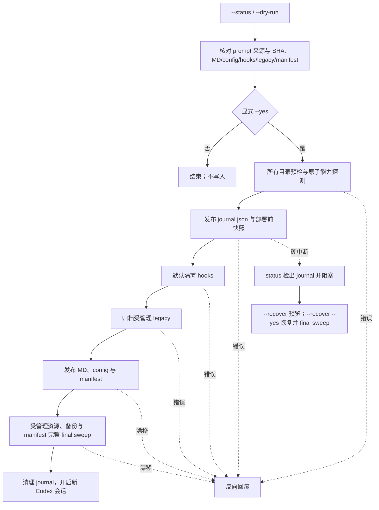

<!-- markdownlint-disable MD013 -->

# 命令参考与内部机制 / Command reference and internals

本页面是完整的参数、状态字段、事务边界和维护者验证细节。日常使用只需要 [`README.md`](../README.md) 的「快速开始」；本页服务于需要理解恢复流程、卸载语义、或参与开发的人。

This page holds the complete option, status-field, transaction-boundary, and maintainer-verification detail. Everyday use only needs the Quick Start in [`README.md`](../README.md); this page is for anyone recovering a deployment, reasoning about uninstall semantics, or contributing.

---

## 简体中文

### 状态输出字段

```bash
python3 codex-instruct.py --codex-dir ~/.codex --status --lang zh-CN
```

```text
[状态] 找到 1 个 Codex 配置目录（只读检查）:

── 状态目录: <codex-dir> ──
    config.toml: regular file (<codex-dir>/config.toml)
    your-rules.md: regular file (<codex-dir>/your-rules.md)
    historical-legacy-prompt.md: missing (<codex-dir>/historical-legacy-prompt.md)
    hooks.json: missing (<codex-dir>/hooks.json)
    hooks.json.disabled: regular file (<codex-dir>/hooks.json.disabled)
    部署清单: regular file (<codex-dir>/.codex-keysmith-manifest.json)
    model_instructions_file: ./your-rules.md
    事务残留: none
    旧版迁移: 无需处理
    hooks 恢复: 可执行 <restore-command>
    结构健康: healthy
    卸载就绪度: ready
    可部署性: ready
```

`--status` 不修改文件，也不读取或解析 active/disabled hooks 内容。它会读取 manifest 并验证其要求的恢复备份证据；必要 hooks backup 缺失、异常或漂移时，卸载就绪度和可部署性都为 `blocked`，返回 1。它还用目录枚举和 `lstat` 检出 `.codex-keysmith-transaction-<id>`、cleanup claim/marker 与 `.keysmith-*` 残留；status 不解析 `journal.json`，恢复内容只由显式 `--recover` 读取。

### 会修改哪些文件

| 路径 | 确认部署行为 |
| --- | --- |
| `<codex-dir>/<name>.md` | 新建；已有普通文件时先创建时间戳备份再替换 |
| `<codex-dir>/config.toml` | 仅在顶层值需要变化时备份并更新；值相同则保持原字节 |
| `<codex-dir>/hooks.json` | 默认先备份，再整体隔离为 `hooks.json.disabled` |
| `<codex-dir>/hooks.json.disabled` | 已存在时先移动到时间戳备份，再发布新的 disabled 文件 |
| `<codex-dir>/historical-legacy-prompt.md` | 被引用或匹配历史内置内容时事务归档；自定义孤立文件保留 |
| `<codex-dir>/.codex-keysmith-manifest.json` | 记录 MD/config、实际隔离的 hooks、实际归档的 legacy、备份与上一层 manifest |
| `<codex-dir>/.codex-keysmith-transaction-<id>/` | 保存 deploy/uninstall journal、固定名称 pending 文件、不可变 `intent.json` 和 before snapshots；deploy 另有 manifest companion，终态使用 `committed` / `recovered` 与可重入 cleanup marker 清理 |
| `<codex-dir>/.keysmith-*` | 单步骤临时目录；正常完成后清理，异常残留会阻止后续写入 |

受管理节点必须是普通文件。符号链接、悬空链接、目录、FIFO、socket 或无效 UTF-8 会 fail closed。config 的长期 manifest 所有权是语义化的顶层 `model_instructions_file`，不是整份 `config.toml`：只要当前值仍为 `./<manifest md.path>`，CCSwitch 等外部工具重写无关字段不会阻塞 status/uninstall；若本层部署曾修改该字段，卸载从已验证的整文件备份提取部署前语句并合并进当前 config（部署前无该语句则只删除当前语句），保留其他 live 内容；若本层 `config.changed=false`，卸载不写 config。目标字段缺失、指向其他路径、重复、歧义或扫描器不支持的语句结构仍会 fail closed。内置零依赖扫描器不声称完整验证无关 TOML 值语法或跨表键冲突。完整文件指纹继续用于预检读取、CAS、journal before snapshot、回滚、并发拒绝和崩溃恢复；合并后的 config 在 immutable uninstall intent 中固定唯一 SHA-256 after 状态。只有本次确实隔离的 hooks 和确实归档的 legacy 才进入 manifest 所有权；未隔离 hooks 与未受管理 legacy 不会被 uninstall 验证或改写。显式 `--skip-hooks-isolation` 时，hooks 节点完全排除在计划、manifest 和读写边界之外，但仍可能继续影响模型行为。

### 内部工作流程



### 自定义指令与 CLI 语言

```bash
python3 codex-instruct.py \
  --file ./my-prompt.md \
  --name my-rules \
  --codex-dir ~/.codex \
  --dry-run \
  --lang zh-CN
```

确认后把 `--dry-run` 改为 `--yes`。外部 Markdown 必须是 no-follow 普通 UTF-8 文件。`--name` 只允许 ASCII 字母、数字、点、下划线和连字符，不接受路径分隔符、绝对路径、`..`、空格或空名称。`historical-legacy-prompt` 是旧版迁移保留名，不能作为自定义 `--name`。

`--lang auto|zh-CN|en` 控制 CLI 输出：

- `auto` 依次读取 `LC_ALL`、`LC_MESSAGES`、`LANG`；值以 `zh` 开头时使用简体中文，以 `en` 开头时使用英文；
- 其他已设置但不受支持的 locale 安全回退到 `zh-CN`；三项环境变量都缺失时，再读取系统 locale，识别 English/Chinese 名称，否则回退 `zh-CN`；
- `--lang zh-CN` / `--lang en` 明确覆盖自动选择；
- `--version` 输出当前脚本版本，不访问 Codex 配置。

### hooks 单独恢复

```bash
python3 codex-instruct.py --codex-dir ~/.codex --restore-hooks --lang zh-CN
```

恢复只处理 `hooks.json.disabled -> hooks.json`，不部署 MD、不编辑 config，也不读取 JSON：没有 disabled 文件是成功 no-op；active 与 disabled 同时存在时不覆盖任一方，返回 1；异常节点、事务残留或并发漂移返回 1 并保留证据；`--restore-hooks` 不接受 `--yes`、`--file`、`--name` 或 `--skip-hooks-isolation`。

### 中断事务恢复

`--recover` 处理 deploy 或 uninstall 在首次修改前创建的 `.codex-keysmith-transaction-<id>/journal.json` 和快照，并按不可变 `operation` 选择恢复算法：

```bash
python3 codex-instruct.py --codex-dir ~/.codex --recover --lang zh-CN        # 预览
python3 codex-instruct.py --codex-dir ~/.codex --recover --yes --lang zh-CN  # 确认
```

- 指定任一参与目录即可；日志会列出并验证同一 transaction ID 的全部参与目录；
- 预检交叉验证 journal、不可变 intent、owner、参与者、before snapshots，以及每个 live 资源当前是否属于记录的 before/after 状态；deploy 额外验证 manifest intent；
- 未知事务残留、外部篡改参与者、快照漂移或用户并发内容都会 fail closed，日志与证据原样保留；
- deploy 按反向参与目录和 `manifest -> config -> MD -> legacy -> disabled hooks -> active hooks` 恢复；uninstall 按反向参与目录恢复 manifest/archive、legacy、hooks、MD 和 config 的 before state；
- 全部资源、恢复出的上一层 manifest 所有权和 journal companion 完成最终 sweep 后，才按精确 residue 名称、目录 identity、成员集合与指纹清理；
- 成功部署先写入 `committed`，成功恢复先写入 `recovered` 并再做一次 final sweep；
- 同时发现多个 transaction ID 时不会猜测合并，应分别指定其参与目录恢复。

`--recover` 不等同于 `--restore-hooks` 或新的 `--uninstall`：recover 回到被中断的 deploy/uninstall 开始前，restore-hooks 只重新启用 disabled hooks，新的 uninstall 撤销已成功完成且有 manifest 的最新部署层。完整状态机见 [`hooks-transactions.md`](hooks-transactions.md)。

### 清单式分层卸载

```bash
python3 codex-instruct.py --codex-dir ~/.codex --uninstall --lang zh-CN        # 预览
python3 codex-instruct.py --codex-dir ~/.codex --uninstall --yes --lang zh-CN  # 卸载一层
```

卸载仅处理 `.codex-keysmith-manifest.json` 明确拥有的最新一层：

- 先验证当前 MD、config 顶层 `model_instructions_file` 语义所有权、实际隔离的 hooks、实际归档的 legacy、全部必要备份和 manifest 的预期存在状态；config 字节仍匹配 manifest after 时沿用普通路径，只有 mtime 改变但字节相同也可继续；
- 任一路径漂移、备份缺失、manifest 无效或节点异常时，所有目录都在写入前停止；
- 首次修改前为全部参与目录发布 immutable durable intent、精确资源定义和 before snapshots；硬中断后由 `--recover` 反向恢复；
- 恢复该层部署前的 config 与 MD；仅当 manifest 记录了真实隔离/归档时，才恢复 hooks、旧 disabled hooks 或 legacy；
- 当前 manifest 原子归档为 `.codex-keysmith-manifest.json.uninstalled_<timestamp>`；
- 如果该层覆盖了上一份 manifest，则恢复上一层。再次运行 uninstall 才会继续撤销下一层；
- 找不到 manifest 是成功 no-op。v0.1.0 之前没有 manifest 的部署不属于自动所有权范围。

`--restore-hooks` 只恢复 hooks；`--uninstall` 按 manifest 恢复整层用户配置。

### 升级工具与回滚

1. 从新的固定 Release 下载新的独立脚本或 bundle，并用该 Release 的 `SHA256SUMS` 校验。
2. 保留旧脚本和旧 Release 资产，不覆盖式替换。
3. 运行新脚本的 `--version`、`--status`、`--dry-run`。
4. 确认后部署；新部署会生成新的 manifest 层。
5. 如需回退，先用新脚本执行一次 `--uninstall --yes` 撤销最新层；需要继续回退时逐层重复。hooks 只需单独恢复时使用 `--restore-hooks`。
6. 代码本身的版本回退是重新使用已校验的旧 Release 脚本；它不会自动改变用户配置。用户配置回退必须显式 uninstall/restore。

### 备份保留与安全清理

工具不会自动删除 `*.bak_*`、`*.recovery_*` 或 `.uninstalled_*`。durable journal 会在成功 deploy/uninstall、干净运行时回滚或成功 `--recover` 后清理；一旦恢复预检失败，它会与快照和未知残留一起保留，作为所有权、恢复和事故排查证据。

只有在以下条件全部满足后，才考虑清理：

1. `--status` 无阻塞，不存在 durable journal，且不再需要继续分层 uninstall；
2. 当前 `config.toml` 不引用准备移走的 MD/legacy 文件；
3. 当前 manifest 及所有更早 manifest 都不引用对应备份；
4. `hooks.json` / `hooks.json.disabled` 状态已人工确认；
5. 先复制整个 `.codex` 目录或把候选文件移动到仓库外的可恢复归档/系统废纸篓，再观察新的 Codex 会话。

不要直接删除当前 manifest、事务残留或无法确认所有权的备份。

### 旧文件名迁移

当显式 `--file` 部署到默认目标名 `your-rules.md` 时，工具检查 `historical-legacy-prompt.md`。被 config 引用或匹配历史版本指纹的普通文件会事务归档；只保留历史 SHA-256 用于识别，不捆绑旧提示词内容。只有这种 `archive` 动作进入 manifest 所有权。未引用的自定义内容保留并标记为未受管理，manifest 不记录其指纹，uninstall 不检查或改写它。为避免与迁移路径冲突，`--name historical-legacy-prompt` 被保留并拒绝。

### 参数与退出码

| 参数 | 说明 |
| --- | --- |
| `--file`, `-f` | 外部 Markdown；必须显式提供，本工具不再捆绑内置提示词 |
| `--name`, `-n` | 输出文件名，不含 `.md`；默认 `your-rules` |
| `--dry-run` | 预览部署，不写文件 |
| `--yes` | 确认常规部署、清单式卸载或中断恢复 |
| `--codex-dir` | 显式选择单个 `.codex`；省略后使用自动发现 |
| `--status` | 只读状态；不解析 hooks JSON |
| `--restore-hooks` | 只恢复 disabled hooks |
| `--uninstall` | 预览或撤销最新一层受管理部署 |
| `--recover` | 预览或恢复 durable journal 记录的中断 deploy/uninstall |
| `--skip-hooks-isolation` | 保持 hooks 活跃；必须显式指定 `--codex-dir` |
| `--lang auto\|zh-CN\|en` | 自动或显式选择 CLI 输出语言 |
| `--version` | 显示脚本版本并退出 |

| 退出码 | 含义 |
| --- | --- |
| `0` | 成功部署、无阻塞预览/status、成功 restore/uninstall/recover，或正常 no-op |
| `1` | 所有权/完整性/节点/config 冲突、事务日志或残留、并发漂移、恢复或回滚失败 |
| `2` | argparse 参数错误、互斥模式或缺少参数约束 |

### 事务边界与已知限制

- 文件内容会 `fsync`，目标发布使用同卷原子无覆盖重命名，并在关键阶段复核完整指纹；
- 复制型备份通过集中式文件系统后端独占、no-follow 创建并持久化：POSIX 使用 `0600` 后再应用原文件权限；Windows 使用受保护 ACL，并以原生句柄复核稳定身份与完整指纹；
- 多目录 deploy/uninstall 先全部预检，再持久化私有 journal 目录、journal/intent JSON 和 before snapshots，之后才修改资源；
- 部署、`--recover` 和 uninstall 都在删除自身恢复证据前执行全部受管理参与目录的 final fingerprint sweep；
- 不跟随 symlink，不使用完整 TOML 解析器；遇到歧义、重复目标键、占用命名空间或不安全语法时停止；
- `SIGKILL` 无法运行 Python 回滚，但 deploy/uninstall 首次修改前已完成持久化 journal；后续 status 会检出并 fail closed，等待显式 `--recover`；
- macOS/Linux 使用 file/directory `fsync`；Windows P0 后端对受管理文件和目录句柄执行 `FlushFileBuffers`。Windows 逐 journal phase 的硬中断证据仍属 P1，因此该实现契约与 `EXPLICIT_BETA` fresh-deployment 策略都不等于正式支持；
- journal、intent、companion、manifest 与 cleanup claim 用于防止意外漂移和普通竞态，不是抵御同一账户协同篡改多份证据的密码学认证；
- `model_instructions_file` 是全局配置，没有 profile 隔离；hooks 只能整份隔离；
- 工具不验证外部 Markdown 的语义，也不保证任何模型或版本采用完全相同的行为。

完整状态机见 [`hooks-transactions.md`](hooks-transactions.md)。

### 维护者验证

```bash
python3 -m py_compile codex-instruct.py scripts/build_release.py
python3 -m pytest -p no:cacheprovider -q tests
python3 -m ruff check codex-instruct.py tests scripts
python3 -m coverage erase
python3 -m coverage run --branch --parallel-mode -m pytest -p no:cacheprovider -q tests
python3 -m coverage combine
python3 -m coverage report --include=codex-instruct.py --fail-under=81

# pre-tag / PR / CI candidate：完整 checkout；既有版本冲突必须精确拒绝
RELEASE_TAG="v$(tr -d '\r\n' < VERSION)"
SOURCE_COMMIT="$(git rev-parse --verify 'HEAD^{commit}')"
python3 scripts/build_release.py "$RELEASE_TAG" --source-commit "$SOURCE_COMMIT" --output-dir dist-candidate
(cd dist-candidate && sha256sum --check SHA256SUMS)

# formal Release 仅在另行批准并创建不可变 tag 后执行；候选阶段不要运行
# python3 scripts/build_release.py "$RELEASE_TAG" --output-dir dist
# (cd dist && sha256sum --check SHA256SUMS)
git diff --check
```

候选构建只接受 40/64 位完整 commit object ID，要求 HEAD 精确匹配；如果 `v$VERSION` 已存在，它也必须指向该 commit。正式构建要求 annotated tag、VERSION、HEAD 和 peeled SHA 指向同一 commit，且要求干净工作树并拒绝覆盖不同内容的既有资产。当前测试集为 400+ 项，覆盖显式提示词文件、CLI、目录发现、多目录 durable journal/recovery、权限、Unicode、symlink、hooks、TOML、manifest/uninstall、真实进程争用和 Release 资产可重复构建。

### 项目结构

```text
codex-keysmith/
├── .github/
│   ├── ISSUE_TEMPLATE/
│   ├── pull_request_template.md
│   └── workflows/
│       ├── release.yml
│       └── tests.yml
├── docs/
│   ├── reference.md
│   ├── recovery-and-uninstall.md → see hooks-transactions.md
│   ├── agent-install.md
│   ├── hooks-transactions.md
│   └── legacy/
├── examples/your-rules.md
├── scripts/build_release.py
├── tests/
├── CHANGELOG.md
├── CONTRIBUTING.md
├── SECURITY.md
├── VERSION
├── codex-instruct.py
├── pyproject.toml
├── requirements-quality.txt
└── README.md
```

---

## English

### Status output fields

```bash
python3 codex-instruct.py --codex-dir ~/.codex --status --lang en
```

`--status` changes no files and never reads or parses active/disabled hook content. It reads the manifest and verifies required restoration evidence; a missing, abnormal, or drifted required hook backup makes uninstall readiness and deployability `blocked` and exits 1. It also detects `.codex-keysmith-transaction-<id>`, cleanup claims/markers, and `.keysmith-*` residue through directory enumeration and `lstat`. Status never parses `journal.json`; only explicit `--recover` reads recovery content.

### Files changed by a confirmed deployment

| Path | Behavior |
| --- | --- |
| `<codex-dir>/<name>.md` | Create, or back up and replace an existing regular file |
| `<codex-dir>/config.toml` | Back up and update only when the top-level value changes; otherwise preserve bytes |
| `<codex-dir>/hooks.json` | Back up and isolate the whole active file as `hooks.json.disabled` by default |
| `<codex-dir>/hooks.json.disabled` | Back up an existing disabled file before publishing new disabled state |
| `<codex-dir>/historical-legacy-prompt.md` | Transactionally archive referenced/historical content; preserve unmanaged custom content |
| `<codex-dir>/.codex-keysmith-manifest.json` | Record MD/config, actually isolated hooks, actually archived legacy state, backups, and the previous manifest layer |
| `<codex-dir>/.codex-keysmith-transaction-<id>/` | Holds deploy/uninstall journals, fixed-name pending files, immutable `intent.json`, and before-state snapshots |
| `<codex-dir>/.keysmith-*` | Per-step temporary directories; normal completion removes them, and residue blocks later writes |

Managed targets must be regular files. Symlinks, dangling links, directories, FIFOs, sockets, and invalid UTF-8 fail closed. Long-lived config ownership is semantic ownership of the top-level `model_instructions_file`, not ownership of all `config.toml` bytes. CCSwitch-style rewrites of unrelated fields remain compatible while the field still equals `./<manifest md.path>`. If deployment changed that field, uninstall extracts the original statement from the verified full-file backup and merges only that statement into the live config (or removes it when originally absent), preserving all other live content; with `config.changed=false`, uninstall does not write config. Missing/different target references, duplicate or ambiguous target fields, unsupported statement structure, and abnormal nodes fail closed. The built-in zero-dependency scanner does not claim complete validation of unrelated TOML value syntax or cross-table key conflicts. Full-file fingerprints remain operation-time CAS, journal snapshot, rollback, concurrency, and crash-recovery evidence; a merged uninstall after-state is fixed by one SHA-256 in immutable intent. With `--skip-hooks-isolation`, hook paths are completely outside planning, manifest ownership, and the read/write boundary, but active hooks can continue to affect model behavior.

### Custom prompt and CLI language

```bash
python3 codex-instruct.py --file ./my-prompt.md --name my-rules --codex-dir ~/.codex --dry-run --lang en
```

`--name` accepts only ASCII letters, digits, dots, underscores, and hyphens; separators, absolute paths, `..`, spaces, and empty names are rejected. `historical-legacy-prompt` is reserved for legacy migration.

`--lang auto|zh-CN|en` checks `LC_ALL`, `LC_MESSAGES`, then `LANG`; an explicit `--lang` overrides detection.

### Restore hooks

```bash
python3 codex-instruct.py --codex-dir ~/.codex --restore-hooks --lang en
```

Restore only performs `hooks.json.disabled -> hooks.json`. An absent disabled file is a successful no-op; active and disabled files together, abnormal nodes, or concurrent drift exit 1 and preserve evidence.

### Recover an interrupted transaction

```bash
python3 codex-instruct.py --codex-dir ~/.codex --recover --lang en        # preview
python3 codex-instruct.py --codex-dir ~/.codex --recover --yes --lang en  # apply
```

Selecting any participant is sufficient; the journal lists and verifies every participant with the same transaction ID. Unknown transaction residue, a tampered external participant, snapshot drift, or concurrent user content fails closed and preserves all journal evidence. Full state machine: [`hooks-transactions.md`](hooks-transactions.md).

### Manifest-based layered uninstall

```bash
python3 codex-instruct.py --codex-dir ~/.codex --uninstall --lang en        # preview
python3 codex-instruct.py --codex-dir ~/.codex --uninstall --yes --lang en  # remove one layer
```

Uninstall only touches the newest layer owned by `.codex-keysmith-manifest.json`. Unrelated live `config.toml` rewrites are preserved when the top-level `model_instructions_file` still references the manifest-owned Markdown. A missing/different target reference, target-field ambiguity or unsupported statement structure, managed-resource drift, missing backups, invalid manifests, or abnormal nodes stops every selected directory before writes. An absent manifest is a successful no-op.

### Upgrade and rollback

1. Download the next fixed Release script or bundle and verify its `SHA256SUMS`.
2. Keep the old verified script and assets; do not overwrite them in place.
3. Run the new script's `--version`, `--status`, and `--dry-run`.
4. Confirm deployment; it creates a new manifest layer.
5. To roll back, run `--uninstall --yes` for the newest layer with the new script. Use `--restore-hooks` when only hooks need restoration.

### Options and exit codes

| Option | Description |
| --- | --- |
| `--file`, `-f` | External Markdown; must be supplied explicitly — this build ships no bundled prompt |
| `--name`, `-n` | Destination name without `.md`; default `your-rules` |
| `--dry-run` | Preview deployment without writes |
| `--yes` | Confirm deployment, manifest-based uninstall, or interrupted-transaction recovery |
| `--codex-dir` | Explicitly select one `.codex`; omission uses discovery |
| `--status` | Read-only status; never parses hook JSON |
| `--restore-hooks` | Restore disabled hooks only |
| `--uninstall` | Preview or remove the newest managed layer |
| `--recover` | Preview or restore an interrupted deploy/uninstall |
| `--skip-hooks-isolation` | Keep hooks active; requires explicit `--codex-dir` |
| `--lang auto\|zh-CN\|en` | Auto-detect or explicitly select CLI output language |
| `--version` | Print the script version and exit |

| Code | Meaning |
| --- | --- |
| `0` | Success, blocker-free preview/status, or normal no-op |
| `1` | Ownership/integrity/node/config conflict, journal/residue, drift, or recovery/rollback failure |
| `2` | argparse error, conflicting modes, or an unmet argument constraint |

### Transaction boundaries and known limits

- File content is `fsync`ed; publication uses same-volume atomic no-replace renames.
- `SIGKILL` cannot run Python rollback, but the durable journal is prepared before the first mutation; a later status detects it and fails closed until explicit `--recover`.
- Windows P0 backend calls `FlushFileBuffers` on managed handles; the per-journal-phase hard-interruption matrix remains P1, so it is not a formal support claim.
- Journal, intent, companion, manifest, and cleanup-claim evidence is not cryptographic authentication against coordinated same-user tampering.
- `model_instructions_file` is global, not profile-scoped; hook isolation is whole-file only.

Full state model: [`hooks-transactions.md`](hooks-transactions.md).

### Maintainer verification

```bash
python3 -m py_compile codex-instruct.py scripts/build_release.py
python3 -m pytest -p no:cacheprovider -q tests
python3 -m ruff check codex-instruct.py tests scripts
python3 -m coverage erase
python3 -m coverage run --branch --parallel-mode -m pytest -p no:cacheprovider -q tests
python3 -m coverage combine
python3 -m coverage report --include=codex-instruct.py --fail-under=81

RELEASE_TAG="v$(tr -d '\r\n' < VERSION)"
SOURCE_COMMIT="$(git rev-parse --verify 'HEAD^{commit}')"
python3 scripts/build_release.py "$RELEASE_TAG" --source-commit "$SOURCE_COMMIT" --output-dir dist-candidate
(cd dist-candidate && sha256sum --check SHA256SUMS)
git diff --check
```

400+ tests cover explicit instruction files, CLI behavior, discovery, multi-directory durable journal/recovery, permissions, Unicode, symlinks, hooks, TOML, manifest/uninstall, real-process contention, and reproducible release assets.

### Project layout

```text
codex-keysmith/
├── .github/
├── docs/
├── examples/your-rules.md
├── scripts/
├── tests/
├── CHANGELOG.md
├── CONTRIBUTING.md
├── SECURITY.md
├── VERSION
├── codex-instruct.py
├── pyproject.toml
├── requirements-quality.txt
└── README.md
```
